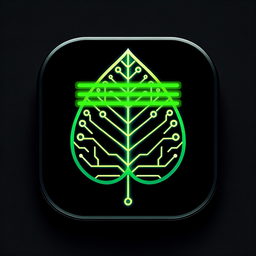

<p align="center">
  <a href="https://notepatra.org"></a>
  <h1 align="center"><a href="https://notepatra.org" style="text-decoration:none;color:inherit;">Notepatra</a></h1>
  <p align="center"><em>The first code editor built for the AI era.</em></p>
  <p align="center">
    <strong>C++ + Rust</strong> · <strong>~4 MB bare native executable</strong> · <strong>Zero Electron</strong> · <strong>100+ file types</strong> · <strong>Local AI formatters</strong>
  </p>
  <p align="center">
    <a href="https://notepatra.org">Website</a> ·
    <a href="https://github.com/singhpratech/notepatra/releases/latest">Download</a> ·
    <a href="#features">Features</a> ·
    <a href="#the-story">The Story</a> ·
    <a href="#install">Install</a> ·
    <a href="#plugins">Plugins</a> ·
    <a href="#ai-powered">AI</a> ·
    <a href="CONTRIBUTING.md">Contributing</a> ·
    <a href="SECURITY.md">Security</a> ·
    <a href="CHANGELOG.md">Changelog</a>
  </p>
  <p align="center">
    <a href="https://github.com/singhpratech/notepatra/actions/workflows/build.yml"></a>
    <a href="https://github.com/singhpratech/notepatra/actions/workflows/codeql.yml"></a>
    <a href="https://github.com/singhpratech/notepatra/releases/latest"></a>
    <a href="https://github.com/singhpratech/notepatra/blob/main/LICENSE"></a>
    <a href="SECURITY.md"></a>
  </p>
  <p align="center">
    <a href="https://github.com/singhpratech/notepatra/releases"></a>
    <a href="https://github.com/singhpratech/notepatra/stargazers"></a>
    <a href="https://github.com/singhpratech/notepatra/network/members"></a>
    <a href="https://github.com/singhpratech/notepatra/issues"></a>
    <a href="https://github.com/singhpratech/notepatra/commits/main"></a>
  </p>
</p>

---

## The Story

I'm Prateek Singh. A developer who spent years on Linux watching Windows users open Notepad++ and fix things in seconds — broken JSON, messy SQL, tangled HTML — while I was stuck with Wine hacks or bloated Electron editors eating 500 MB of RAM to show a text file.

Every text editor told me to pick two: **fast**, **powerful**, or **native**. Vim is fast but cryptic. VS Code is powerful but heavy. Notepad++ is both — but it only runs on Windows.

So I built Notepatra.

Not a port. Not a wrapper. Not "Notepad++ but on Linux." Something new — **for everyone**.

I took what made Notepad++ legendary — the speed, the simplicity, the "it just works" feeling — and asked: **what would Notepad++ look like if it was built today, in 2026, when AI is part of every developer's workflow?**

The answer: a tiny native executable — roughly 4 MB bare (stripped) on every platform — with a Rust-powered core, Scintilla editing engine, and local AI integration. Downloads: ~2 MB on Linux (tarball, Qt from the system), ~22 MB on macOS (DMG with bundled Qt), ~40 MB on Windows (MSI/zip with bundled Qt DLLs). An editor that can fix your broken JSON with regex in milliseconds — and when regex isn't enough, it asks your local AI to figure it out. No cloud. No telemetry. No subscription. Just you and your code.

Notepatra started on Linux — because that's where the gap was. But great tools shouldn't have borders. **Notepatra runs on Linux, Windows, and macOS.** Same codebase. Same features. No one gets left behind.

**Notepatra isn't trying to replace Notepad++. It's what I wish existed — on every platform.**

---

## Features

### Editor — Battle-tested basics done right
- **178 file extensions** mapped to the best available QScintilla lexer — Python, C/C++, Java, JavaScript, TypeScript, SQL, HTML, CSS, JSON, YAML, Markdown, Bash, Fortran, VHDL, Verilog, MATLAB, LaTeX, and more. Rust / Go / Swift / Kotlin currently fall back to the C-family lexer (close enough for brace/string/comment highlighting — not a Rust-native analyser)
- **Tabbed editing** — drag, reorder, middle-click close, double-click empty area for new tab
- **Tab right-click menu** — Close, Close All BUT This, Close All to the Left/Right, Close All, Save, Save As, Rename, Copy Full Path, Copy Filename, Copy Directory Path, Open Containing Folder, Open Terminal Here, Read-Only toggle, **Color Tag** (7 named colors + custom + Remove)
- **3 themes** — Light, Dark, Monokai (Settings > Theme)
- **Session persistence** — close Notepatra, reopen tomorrow, same files, same cursor positions, same window size
- **Crash recovery** — if Notepatra crashes (it shouldn't, but life happens), your unsaved work is recovered on next launch
- **File change detection** — someone else edits your file? Notepatra asks: reload or keep yours?
- **2 GB file support** — memory-mapped I/O via Rust, opens massive files without truncation
- **Double-click word highlight** — double-click any word, all occurrences light up in orange
- **Ctrl+B brace matching** — jump between matching `{}` `[]` `()`, highlights both braces + selects everything between
- **Macro recording** — Start Recording (Ctrl+Shift+M), Stop, Playback (Ctrl+Shift+P), Run Multiple Times, Save/Load macros
- **Code folding**, **bookmarks**, **auto-complete**, **indent guides**, **line numbers**
- **Custom scrollbars** — clean, modern, rounded

### Search — Find anything, anywhere
- **Project Search (`Ctrl+Shift+G`)** — recursive search across **file names AND file contents** in any text-based file. Any size, any language (Python, SQL, C/C++, JS/TS, Rust, Go, HTML, JSON, YAML, Markdown, logs, config). Streams line-by-line so a 2 GB log searches the same as a 2 KB script. Each match shows exact `line:col` coordinates — double-click to jump the caret to the character.
- **5-tab Find/Replace dialog** — Find, Replace, Find in Files, Mark, Go to
- **3 search modes** — Normal, Extended (`\n`, `\r`, `\t`, `\xNN`), Regular expression
- **Find All in Current Document** — results appear in bottom panel, double-click any result to jump to that exact line
- **Find All in All Opened Documents** — search across every open tab at once
- **Replace All in All Opened Documents** — one click, every file updated
- **Find in Files** — search entire directories recursively with file filters
- **Mark All** — highlight every occurrence with visual indicators
- **Aho-Corasick search engine** (Rust) — faster than regex for literal patterns

### Plugins — The real power

Every plugin opens in its own tab. Real UI, not just a menu click.

#### JSON Tools (inbuilt)
| Button | What it does |
|---|---|
| **Format** | Pretty-print with preserved key order |
| **Minify** | Compact to one line |
| **Fix + Format** | Rust-powered auto-repair: fixes missing braces, trailing commas, single quotes, unquoted keys, missing `{` after `[` — shows detailed report of every fix |
| **AI Fix (Ollama)** | Sends truly broken JSON to your local AI — fixes what regex can't |

#### HTML Tools (inbuilt)
| Button | What it does |
|---|---|
| **Format (2/4 spaces)** | Proper HTML indentation |
| **Minify** | Strip all whitespace |
| **Fix + Format** | Auto-close unclosed tags, detect missing closers, report issues |
| **AI Fix (Ollama)** | AI repairs broken nesting, malformed tags, missing attributes |

#### Bracket Tools (inbuilt)
| Button | What it does |
|---|---|
| **Check** | Detailed report: line numbers of every mismatched `()` `[]` `{}`, keyword mismatches (`begin`/`end`, `if`/`fi`) |
| **Auto-Fix** | Adds missing closers in correct nesting order |
| **AI Fix (Ollama)** | AI understands your code structure and fixes all bracket issues |

#### SQL Formatter (inbuilt)
- Format with **UPPERCASE** or **lowercase** keywords
- Configurable indent width
- Supports T-SQL, PL/SQL, MySQL, PostgreSQL, SQLite

#### Compare / Diff (inbuilt)
- Pick **any two tabs** or **any tab vs file on disk**
- Side-by-side **Scintilla editors** with a ComparePlus-style **overview/nav bar**
- `+` green for added, `-` red for deleted, `#` amber for changed
- **Word-level LCS intra-line diff** — within a changed line, the specific
  *tokens* that were removed are highlighted in red on the left pane; the
  tokens that were added are highlighted in green on the right pane. Works
  on actual word boundaries, not just common-prefix/suffix.
- **Dark-mode aware** — colours track your Notepatra theme (Light / Dark /
  Monokai) so diffs stay readable on both black and white backgrounds.
- **Prev/Next diff** navigation, inline overview-bar jump
- **Ignore whitespace**, **ignore case**, **ignore empty lines** checkboxes
- **Unlock for editing** mode — edit either pane and re-diff in place
- Powered by Rust Myers diff (line-level) + C++ LCS (word-level)
- **Visual UX inspired by [ComparePlus](https://github.com/pnedev/comparePlus) by Pavel Nedev** — credit where credit is due.

#### Git Integration (inbuilt)
- **Staged / Unstaged trees** — porcelain v2 parser, inline `+` / `−` buttons per row to stage/unstage
- **Branch chip with ahead/behind** — shows `main ↑3 ↓1` when diverged
- **Commit box (Ctrl+Enter)** — line-count indicator, blocks commit when nothing's staged
- **Sync row** — one-click Pull / Push / Fetch with live ahead/behind refresh
- **Collapsible history + stash menu** — recent commits expandable; stash / pop / list / drop
- **Git gutter** — green/yellow/red markers in editor margin for changed lines

### AI Powered — Local, private, no cloud

Backend dropdown ships **7 entries** — **Ollama**, **llama.cpp (GGUF)**, **OpenRouter** (cloud), **LM Studio**, **Jan**, **OpenAI**, and **Custom** (any OpenAI-compatible endpoint, so vLLM / KoboldCpp / llamafile / TGI all work via the Custom entry with the URL pasted in). API key edits inline — no digging into settings. Nothing leaves your machine unless you point it to a cloud backend. No telemetry. No subscription.

#### AI Assistant — side-dock (`Ctrl+Shift+A`)
The AI chat lives in a **persistent right-side dock**, not an editor tab. One conversation, preserved across tab switches. Tick **Coding Mode** to open the 3-column coding layout (file tree · editor · AI chat) 3-pane layout.

**Workspace awareness.** Every prompt carries:
- the selection (or full file if no selection is active)
- the full text of the current file
- excerpts of every other open editor tab
- a flat listing of all files under the workspace root (`.git`, `node_modules`, `target`, `dist`, etc. filtered out)

So the model can reason about files you haven't opened yet — "import from utils.py" works even when utils.py isn't in a tab. Budget-capped so small local models (3B, 4K–8K context) don't overflow.

**One-click actions** (hidden by default, click "▸ Quick actions" to reveal):
Explain · Find Bugs · Refactor · Write Tests · Add Comments · Generate Docs · Optimize · Translate. Or type a custom prompt. Responses stream in, each has a **Copy** link, and the last response can be inserted at the cursor or replace the selection with one click.

**Speech-to-text** — optional mic button, uses local `arecord` + `whisper` CLI when installed. No audio ever leaves the machine.

#### AI Setup
```bash
# Easiest path: Ollama
curl -fsSL https://ollama.com/install.sh | sh
ollama pull qwen2.5-coder:3b   # 2 GB, best for code on CPU-only / 16 GB RAM
ollama serve
```
Notepatra auto-detects the running Ollama and picks the most CPU-friendly model installed. For llama.cpp / LM Studio / OpenRouter, pick the backend from the dropdown at the top of the AI panel; base URL and API key are editable inline.

### More Features

| Feature | Shortcut |
|---|---|
| **Built-in Terminal** | `Ctrl+`` — opens as a tab, runs real commands |
| **REST Client** | `Ctrl+Shift+R` — send HTTP requests, see responses with pretty JSON |
| **Hex Editor** | View > Hex Editor — color-coded hex dump of any binary file |
| **Markdown Converter** | Features > Markdown — convert selection to table, list, code block, bold, link, heading, or strip HTML to markdown |
| **File Explorer** | `Ctrl+Shift+E` — tree view sidebar |
| **Function List** | View > Function List — lists all functions/classes, double-click to navigate |
| **Preferences** | Settings > Preferences — 6 tabs of configuration |

### Keyboard Shortcuts

| Category | Shortcut | Action |
|---|---|---|
| **File** | `Ctrl+N` | New |
| | `Ctrl+O` | Open |
| | `Ctrl+S` | Save |
| | `Ctrl+W` | Close tab |
| **Edit** | `Ctrl+D` | Duplicate line |
| | `Ctrl+Shift+K` | Delete line |
| | `Ctrl+/` | Toggle comment |
| | `Ctrl+Shift+U` | UPPERCASE |
| | `Ctrl+U` | lowercase |
| **Search** | `Ctrl+F` | Find |
| | `Ctrl+H` | Replace |
| | `Ctrl+Shift+G` | Project Search (folder-wide names + contents) |
| | `F3` / `Shift+F3` | Find Next / Previous |
| | `Ctrl+G` | Go to line |
| | `Ctrl+B` | Go to matching brace |
| | `Ctrl+F2` / `F2` | Toggle / Next bookmark |
| **View** | `F11` | Full screen |
| | `Ctrl+=` / `Ctrl+-` | Zoom in / out |
| | `Alt+0` | Fold all |
| **Macro** | `Ctrl+Shift+M` | Start recording |
| | `Ctrl+Shift+T` | Stop recording |
| | `Ctrl+Shift+P` | Playback |
| **Features** | `Ctrl+`` | Terminal |
| | `Ctrl+Shift+A` | AI Assistant |
| | `Ctrl+Shift+E` | File Explorer |
| **Tabs** | `Ctrl+Tab` | Next tab |
| | Middle-click | Close tab |
| | Double-click empty | New tab |

---

## Architecture

```
┌──────────────────────────────────────────────┐
│            C++ Layer (Qt5 + QScintilla)       │
│   UI · Menus · Tabs · Dialogs · Editor       │
│   Terminal · AI Panel · Compare · Plugins     │
├──────────────────────────────────────────────┤
│                C FFI boundary                 │
├──────────────────────────────────────────────┤
│            Rust Core Library                  │
│   File I/O (mmap) · Search (Aho-Corasick)    │
│   Diff (Myers) · JSON/HTML/SQL Formatters    │
│   Bracket Fixer · Hash · Base64 · Encoding   │
└──────────────────────────────────────────────┘
```

**Why this hybrid?**
- **C++** because Qt and QScintilla are C++ — zero friction for UI
- **Rust** because file I/O, text processing, and parsing must never crash — Rust's ownership system guarantees memory safety
- **Result**: the speed of C++, the safety of Rust. The bare stripped executable is roughly **2.7 MB on macOS Apple Silicon**, **3.0 MB on Windows x64**, and **5 MB on Linux x64** — MSVC and clang strip more aggressively in release mode than gcc does. Latest download sizes: **2.8 MB** Linux x64 tar.gz · **2.6 MB** Linux ARM64 tar.gz · **25.5 MB** macOS DMG (with bundled Qt) · **43.5 MB** Windows MSI · **36.3 MB** Windows NSIS · **41.7 MB** Windows portable zip. _Installed footprint on Windows is ~75-85 MB after the MSI extracts bundled Qt + QScintilla DLLs — normal for any Qt-based installer._

---

## Install

### One-command install

**Linux / macOS:**
```bash
curl -fsSL https://notepatra.org/install.sh | sh
```

**Windows (PowerShell):**
```powershell
irm https://notepatra.org/install.ps1 | iex
```

That's it. Auto-detects your OS, downloads the right binary, installs it, adds to PATH, creates shortcuts.

### Or download manually — [Latest release: v0.1.54](https://github.com/singhpratech/notepatra/releases/latest)

| Platform | Download | Size | What's inside |
|---|---|---|---|
| 🐧 **Linux x64** | [`.tar.gz`](https://github.com/singhpratech/notepatra/releases/latest) | **2.8 MB** | Bare `notepatra` binary. Qt5 from your distro. |
| 🐧 **Linux ARM64** | [`.tar.gz`](https://github.com/singhpratech/notepatra/releases/latest) | **2.6 MB** | Bare `notepatra` binary for `aarch64` / ARM64 Linux. |
| 🍎 **macOS Apple Silicon** (M1–M4) | [`.dmg`](https://github.com/singhpratech/notepatra/releases/latest) | **25.5 MB** | `Notepatra.app` with Qt frameworks bundled. Drag to Applications. |
| 🪟 **Windows x64 (MSI)** | [`.msi`](https://github.com/singhpratech/notepatra/releases/latest) | **43.5 MB** | WiX-built MSI. Per-machine install, upgrade-code handled, file-type associations for `.txt`, `.log`, `.md`, `.json`, `.py`, `.cpp` etc., adds Notepatra to PATH. Best for enterprise / SCCM deploy. |
| 🪟 **Windows x64 (installer)** | [`.exe`](https://github.com/singhpratech/notepatra/releases/latest) | **36.3 MB** | NSIS installer. Registers in Settings → Apps → Installed apps. Uninstall via Control Panel works. |
| 🪟 **Windows x64 (portable)** | [`.zip`](https://github.com/singhpratech/notepatra/releases/latest) | **41.7 MB** | `notepatra.exe` + Qt DLLs + QScintilla DLL. Unzip and run anywhere. No installer, no registry. Optional: double-click `register-associations.bat` inside the zip to add Notepatra to the "Open with" menu for `.txt`/`.md`/`.py`/`.json`/etc. — HKCU only, no admin needed. Undo with `unregister-associations.bat`. |

> ⚠ **Download size vs. installed size are different.** The numbers above are **download sizes** — the `.msi` / `.dmg` / `.tar.gz` files you grab from GitHub Releases. After install, the on-disk footprint is larger because the installer extracts the bundled Qt DLLs, QScintilla DLL, and Rust core library out of the compressed payload. **Typical installed size on Windows: ~75-85 MB.** Linux installs are still tiny (~5 MB on disk) because Qt5 comes from your distro repo, not the tarball. macOS Notepatra.app on disk is ~50-60 MB after `xattr` removal.

**Why are the download sizes different?** Bare `notepatra` executable is **~4 MB stripped** on each platform (a little smaller on Windows/macOS than on Linux because clang + MSVC strip more aggressively than gcc). On Linux, Qt5 is a standard system package (`apt install qtbase5-dev libqscintilla2-qt5-dev`), so the download is just the binary (~2 MB compressed). On macOS and Windows, Qt isn't pre-installed, so we bundle the Qt frameworks / DLLs alongside the executable for portability — same approach Krita, Kdenlive, and every cross-platform Qt app uses. Even with Qt bundled, Notepatra installs at 5–85 MB depending on platform vs 300+ MB for VS Code.

> macOS Intel: not shipped pre-built. Apple stopped selling Intel Macs in 2023 and the GitHub Actions `macos-13` runner has been unreliable. Intel Mac users — `git clone` and run `./build.sh`. Builds in ~3 minutes.

### Verify your download

Every release ships with **SHA-256 checksums**, **Sigstore (cosign) signatures**, and **SLSA build provenance**. The `install.sh` and `install.ps1` scripts above already verify SHA-256 automatically and refuse to install on mismatch — but if you downloaded manually you should verify yourself.

```bash
# Linux / macOS — checksum
curl -sL -O https://github.com/singhpratech/notepatra/releases/latest/download/SHA256SUMS
sha256sum -c SHA256SUMS --ignore-missing

# Anywhere — cosign verify (Sigstore)
# Replace `linux-x64` with `linux-arm64` if you downloaded the ARM64 build.
cosign verify-blob \
  --certificate-identity-regexp '^https://github.com/singhpratech/notepatra/' \
  --certificate-oidc-issuer 'https://token.actions.githubusercontent.com' \
  --certificate notepatra-linux-x64.tar.gz.pem \
  --signature  notepatra-linux-x64.tar.gz.sig \
  notepatra-linux-x64.tar.gz

# Anywhere — SLSA build provenance
# Replace `linux-x64` with `linux-arm64` if needed.
gh attestation verify notepatra-linux-x64.tar.gz --owner singhpratech
```

Full instructions, threat model, and disclosure policy in [SECURITY.md](SECURITY.md).

### Stay up to date — safe in-app updater

Notepatra checks `github.com/singhpratech/notepatra/releases/latest` on launch (silent on no-match) and pops a Notepad++-style "A new version is available" dialog when something newer exists. Click **Download** and the updater will:

1. **Pick the right artifact for your OS + architecture** — Linux x64 / ARM64 tar.gz, macOS DMG, Windows MSI (with NSIS `.exe` and portable `.zip` as fallbacks).
2. **Stream-download it** to `~/Downloads/*.part` with a cancellable progress dialog.
3. **Fetch the release's `SHA256SUMS`** and verify the download's hash. **If the hash does not match, the `.part` file is deleted and you are shown an error — nothing on your system is modified.**
4. **Atomic-rename `.part` → final name** once verified.
5. **Hand off to the OS installer** — `msiexec /i` on Windows, `open <dmg>` on macOS (Finder drag to Applications), `xdg-open` on the Downloads folder on Linux so you replace the binary yourself.

**Safety contract — the updater will never leave you with a broken install:**

| Failure | What happens |
|---|---|
| No internet | Error dialog, zero disk writes |
| Download cancelled | `.part` deleted, nothing else touched |
| Power / crash mid-download | `.part` orphan in `~/Downloads`, current binary untouched |
| SHA-256 mismatch | `.part` deleted, critical dialog shown, current binary untouched |
| No `SHA256SUMS` in release | Refuses to auto-install, opens release page for manual verify |
| No matching platform asset | Refuses to auto-install, opens release page |
| OS installer cancelled or fails | Installer's own rollback — current binary untouched |

The Notepatra process **never rewrites or replaces the running binary.** Only the OS installer you explicitly clicked through may do that, and those installers all have their own transactional rollback (MSI `MajorUpgrade`, DMG copy-on-drag, user-driven file-manager swap on Linux).

**Check manually:** `Help → Check for Updates` or `?` menu. The check is also visible on first launch (silent if up to date).

### Windows: refresh "Open with" entry after upgrading from v0.1.23 → v0.1.24

If you upgraded from v0.1.23 or earlier and your right-click → **Open with** menu still shows `Notepatra â€" native code editor` (mojibaked text) and/or a red ❌ overlay on the icon, that's **Windows shell-cache lag, not a Notepatra bug**. Windows' MuiCache permanently caches the `FileDescription` string the first time it reads an executable's `VERSIONINFO`, and never re-reads it on upgrade. The new v0.1.24 binary embeds clean ASCII; Windows is just showing the cached old string.

**One-time fix** — open PowerShell (no admin needed, all changes are HKCU-scoped) and paste this whole block. Tested and confirmed working on Windows 11:

```powershell
# 1. Wipe Notepatra's stale entries from MuiCache (the cache that has the â€" text)
$mui = "HKCU:\Software\Classes\Local Settings\Software\Microsoft\Windows\Shell\MuiCache"
Get-Item $mui | Select-Object -ExpandProperty Property | Where-Object { $_ -match "notepatra" } | ForEach-Object {
    Remove-ItemProperty -Path $mui -Name $_ -Force
    Write-Host "Cleared MuiCache: $_" -ForegroundColor Green
}

# 2. Wipe stale "Open with" associations pointing to old notepatra.exe paths
Remove-Item "HKCU:\Software\Classes\Applications\notepatra.exe" -Recurse -Force -ErrorAction SilentlyContinue
$exts = @(".txt",".log",".md",".json",".py",".cpp",".js",".html",".css",".xml",".sql",".sh",".yml",".yaml",".ini",".conf",".csv",".rs",".go",".java",".rb",".php",".c",".h",".hpp",".tsx",".ts",".jsx")
foreach ($ext in $exts) {
    Remove-Item "HKCU:\Software\Microsoft\Windows\CurrentVersion\Explorer\FileExts\$ext\OpenWithList" -Recurse -Force -ErrorAction SilentlyContinue
    Remove-Item "HKCU:\Software\Microsoft\Windows\CurrentVersion\Explorer\FileExts\$ext\OpenWithProgids" -Recurse -Force -ErrorAction SilentlyContinue
}
Write-Host "Cleared OpenWithList for $($exts.Count) extensions" -ForegroundColor Green

# 3. Force shell to rebuild association cache
ie4uinit.exe -show
ie4uinit.exe -ClearIconCache
Write-Host "Rebuilt shell cache" -ForegroundColor Green

# 4. Restart Explorer (drops in-memory cache)
Stop-Process -Name explorer -Force
Start-Process explorer
Write-Host "Restarted Explorer — right-click any file now to verify" -ForegroundColor Cyan
```

**What it does — line by line:**

| Step | What & why |
|---|---|
| 1. MuiCache wipe | Clears the per-user cache where Windows stores `FileDescription` strings shown in "Open with" / File Properties → Details. This is the cache holding the `â€"` mojibake. |
| 2. Per-extension cache wipe | Removes `OpenWithList` + `OpenWithProgids` for 28 common file types. Forces Windows to re-query the .exe's actual `VERSIONINFO` next time the menu opens. |
| 3. `ie4uinit.exe -show` + `-ClearIconCache` | Built-in Windows tool that rebuilds shell association + icon caches. The red ❌ overlay disappears here. |
| 4. Restart Explorer | Drops the in-memory copy of the cache (the fourth and final layer). Without this, the menu can stay stale until you log out / reboot. |

**Verify it worked**: right-click any `.txt` or `.json` file → *Open with* → the Notepatra entry should now read `Notepatra native code editor for the AI era` with a clean icon. If you still see the old text after this, log out and back in (forces every kernel-side cache layer to flush).

**New v0.1.24 installs on a clean machine never see this** — it only affects upgrades from v0.1.23 or earlier where the mojibaked string was first cached.

### Build from source

<details>
<summary>Linux (Ubuntu/Mint/Debian)</summary>

```bash
sudo apt install cmake qtbase5-dev libqscintilla2-qt5-dev
curl --proto '=https' --tlsv1.2 -sSf https://sh.rustup.rs | sh
source ~/.cargo/env
git clone https://github.com/singhpratech/notepatra.git
cd notepatra
cd rust-core && cargo build --release && cd ..
mkdir build && cd build && cmake .. && make -j$(nproc)
./notepatra
```
</details>

<details>
<summary>macOS</summary>

```bash
brew install qt@5 cmake
curl --proto '=https' --tlsv1.2 -sSf https://sh.rustup.rs | sh
source ~/.cargo/env
git clone https://github.com/singhpratech/notepatra.git
cd notepatra
# Build QScintilla from source (brew's version links Qt6)
./build.sh
```
</details>

<details>
<summary>Windows (MSVC)</summary>

**Prerequisites**
1. **Visual Studio 2022** with the *"Desktop development with C++"* workload
2. **Qt 5.15.2** for `msvc2019_64` — install via [Qt Online Installer](https://www.qt.io/download-qt-installer) or [aqtinstall](https://github.com/miurahr/aqtinstall)
3. **CMake** ≥ 3.16 — `winget install Kitware.CMake` or [cmake.org/download](https://cmake.org/download)
4. **Rust** stable — [rustup.rs](https://rustup.rs)

**Build QScintilla via the CMake wrapper** *(once)*
```powershell
git clone --depth 1 https://github.com/farleyrunkel/QScintilla.git $env:TEMP\qsci-src
cmake -S $env:TEMP\qsci-src -B $env:TEMP\qsci-src\build -G "Visual Studio 17 2022" -A x64 `
  -DCMAKE_BUILD_TYPE=Release `
  "-DCMAKE_PREFIX_PATH=C:\Qt\5.15.2\msvc2019_64" `
  "-DCMAKE_INSTALL_PREFIX=$env:TEMP\qsci-install"
cmake --build $env:TEMP\qsci-src\build --config Release
cmake --install $env:TEMP\qsci-src\build --config Release
```

**Build Notepatra**
```powershell
git clone https://github.com/singhpratech/notepatra.git
cd notepatra
cd rust-core; cargo build --release; cd ..
mkdir build; cd build
cmake .. -G "Visual Studio 17 2022" -A x64 `
  "-DCMAKE_PREFIX_PATH=C:\Qt\5.15.2\msvc2019_64" `
  "-DQSCINTILLA_INCLUDE=$env:TEMP\qsci-install\include" `
  "-DQSCINTILLA_LIB=$env:TEMP\qsci-install\lib\qscintilla2_qt5.lib"
cmake --build . --config Release
```

**Bundle Qt + QScintilla DLLs next to the exe**
```powershell
mkdir notepatra-win
copy build\Release\notepatra.exe notepatra-win\
windeployqt notepatra-win\notepatra.exe
copy $env:TEMP\qsci-install\bin\qscintilla2_qt5.dll notepatra-win\
.\notepatra-win\notepatra.exe
```

> If you hit `LNK2019 unresolved external symbol QsciScintilla::staticMetaObject` — verify `CMakeLists.txt` defines `QSCINTILLA_DLL` for Windows targets. Without it, MSVC won't emit `__declspec(dllimport)` and the linker will fail to resolve symbols against the import library. This is the gotcha that took 12 CI iterations to find.
</details>

---

## Plugin System

Drop a shared library in `~/.config/notepatra/plugins/` and restart.
- Linux: `.so` files
- macOS: `.dylib` files
- Windows: `.dll` files

### Write your own plugin in 30 seconds:

```cpp
// myplugin.cpp
extern "C" {
    const char* notepatra_plugin_name()    { return "My Plugin"; }
    const char* notepatra_plugin_version() { return "1.0"; }
    const char* notepatra_plugin_author()  { return "Your Name"; }

    char* notepatra_plugin_run(const char* text, int len) {
        // Your magic here — transform text, return malloc'd result
        // Return NULL to keep text unchanged
    }
}
```

```bash
# Linux
g++ -shared -fPIC -o myplugin.so myplugin.cpp

# macOS
clang++ -shared -o myplugin.dylib myplugin.cpp

# Windows
cl /LD myplugin.cpp /Fe:myplugin.dll
```

---

## Why not just use...?

| Editor | Download size | Native | Local AI | Built-in JSON fixer | 2 GB files | Linux | Win | Mac | Free |
|---|---|---|---|---|---|---|---|---|---|
| **Notepad++** | ~4 MB | ✓ | ✗ | plugin only | ✗ | ✗ | ✓ | ✗ | ✓ |
| **VS Code** | ~300 MB | ✗ Electron | extension | extension | ✗ | ✓ | ✓ | ✓ | ✓ |
| **Vim / Neovim** | ~3 MB | ✓ | ✗ | ✗ | ✓ | ✓ | ✓ | ✓ | ✓ |
| **Sublime Text** | ~30 MB | ✓ | ✗ | ✗ | ✓ | ✓ | ✓ | ✓ | $99 |
| **Kate / Gedit** | ~30 MB | ✓ | ✗ | ✗ | ✓ | ✓ | ✗ | ✗ | ✓ |
| **Notepatra** | **2.8 / 25.5 / 43.5 MB** | ✓ C++/Rust | ✓ Ollama | ✓ regex + AI | ✓ Rust mmap | ✓ | ✓ | ✓ | ✓ GPL-3 |

> *Notepatra download sizes are Linux x64 tar.gz / macOS DMG / Windows MSI from v0.1.39. Linux is just the binary (Qt is system-installed). macOS and Windows include bundled Qt. The bare `notepatra` executable inside is roughly 5 MB on Linux, 3 MB on Windows, 2.7 MB on macOS — different compilers, different optimization.*

---

## Tests

Focused automated regression tests are wired through CMake + CTest and run in CI. The current suite is **12 tests**:

- `test_lexers` — verifies every shipped QScintilla lexer produces real styling
- `test_palette` — verifies the Notepad++ palette colors and bold/italic styles
- `test_fmtpanel_diff` — verifies formatter panels keep diff state and emit signals
- `test_compare_widget` — verifies the inbuilt Compare panel diff/edit/close paths
- `test_sqlfmt` — 33 assertions across 11 SQL dialects through the AST pretty-printer
- `test_updater` — verifies `pickAssetForPlatform`, SHA256 parsing, and asset scoring (18 assertions)
- `test_projectsearch` — verifies the Rust-backed project search streaming path
- `test_projectsearch_ui` — verifies the Project Search UI bindings
- `test_ollama` — verifies live Ollama model detection (skips cleanly when offline)
- `test_aifix` — exercises the AI-fix cleanup path against a real Ollama daemon (skips cleanly when offline)
- `test_llamacpp` — exercises the llama.cpp backend path
- `test_ai_context` — verifies the AI workspace-context summarizer

Run them locally with:

```bash
./build.sh --tests
```

The Ollama / llama.cpp / AI-fix tests skip cleanly when no inference backend is running, so local and CI runs stay deterministic.

---

## Releases

Notepatra follows [Keep a Changelog](https://keepachangelog.com/) and [Semantic Versioning](https://semver.org/). Every release is tagged, signed, and published to GitHub Releases with binaries for Linux x64, Linux ARM64, macOS Apple Silicon, and Windows x64.

| Version | Date | Highlights |
|---|---|---|
| [**v0.1.54**](https://github.com/singhpratech/notepatra/releases/tag/v0.1.54) | 2026-05-08 | **AI backend dropdown trimmed to 4 + wiring fixes + Search-icon polish.** Removed `Custom` (no URL field in panel chrome — was a no-op), `LM Studio`, and `Jan` (both are just GUI wrappers around llama.cpp; Ollama covers easy local and llama.cpp covers power-user; curated 12-GGUF catalog already in the model dropdown). Dropdown is now exactly **Ollama / llama.cpp (GGUF) / OpenRouter (cloud) / OpenAI**. **Ollama re-detect bug fixed**: switching back from cloud to Ollama now resets the base URL properly (pre-fix, `m_ollama` stayed pointing at openrouter.ai and the `/api/tags` probe failed silently → "(Ollama offline)"). `modelsError` handler dispatched by backend so llama.cpp / OpenRouter / OpenAI catalogs stay visible even when the live probe fails. **Data Analyst banner uses family names** (Claude / GPT / Gemini / Qwen-Coder / Llama) instead of version pins (Claude Sonnet 4.5, GPT-5, …) which would go stale every couple of months. **Banner colours theme-aware** — readable on Light, Dark, Monokai. **Project Search toolbar icon** lens position adjusted (centre 0.40 → 0.44, radius 0.28 → 0.25) so the magnifying-glass stroke at the top-left no longer anti-alias-merges with the rounded square's corner at 150 % DPI. New `OllamaClient::modelsListedRich(QJsonArray)` signal for upcoming v0.1.55 live model picker. **Rust 119 / 119, C++ 19 / 19, build clean.** |
| [**v0.1.53**](https://github.com/singhpratech/notepatra/releases/tag/v0.1.53) | 2026-05-08 | **Curated model lists + Data Analyst welcome card.** The model dropdown now shows curated catalogs per backend instead of just whatever the live `/v1/models` returned: 12 GGUF picks for `llama.cpp` (Qwen2.5-Coder 1.5B/7B/14B, Llama 3.2 3B / 3.1 8B, Phi-4, Gemma 2, Mistral 7B, DeepSeek-Coder-V2-Lite, StarCoder2 — each with HuggingFace download URL in tooltip), 13 cross-provider picks for OpenRouter (Claude Sonnet/Opus/Haiku 4.5, GPT-5 / 5-mini / 4o / o1-mini, Gemini 2.5 Pro / Flash, DeepSeek R1, Llama 3.3 70B, Qwen2.5-Coder 32B, Mistral Large), 6 picks for OpenAI direct. Plus when the user toggles into Data Analyst mode on a fresh chat, a styled orange welcome card now appears at the top of the AI chat with title, one-paragraph explainer, three clickable example prompt chips, connection count + Manage Connections button, model-capability indicator (✓/⚠), and a Hide button (sticky via `Config::aiHideDataWelcome`). Capability banner reworked to mention a local fix (`ollama pull qwen2.5-coder:14b`) instead of cloud-only — pre-fix, local-Ollama users thought paying for cloud was the only way out. **Rust 119 / 119, C++ 19 / 19, build clean.** |
| [**v0.1.52**](https://github.com/singhpratech/notepatra/releases/tag/v0.1.52) | 2026-05-08 | **Toolbar icon HiDPI rendering + Project Search button visibility.** v0.1.50's `AA_UseHighDpiPixmaps` was right but `makeFeatureIcon()` still rasterized to a fixed 32×32 `QPixmap` — at 150% Qt bilinear-scaled the result to ~48 device px → pixelation. Now paints into `32 × dpr` backing store with `setDevicePixelRatio(dpr)` + `painter.scale(dpr, dpr)` so every `drawXxxFeatureGlyph()` produces sub-pixel-precise output at native density. Toolbar Search / AI / Terminal / Compare / JSON / HTML / SQL / Brackets / REST / Git icons stay sharp on Windows 125% / 150% / 175% and Retina. **Buttons are NOT affected** — v0.1.49's per-button min-width and v0.1.50's HighDpiScaleFactorRoundingPolicy::PassThrough are preserved. Plus Project Search Cancel + Clear history button labels switched from `textPrimary`/`#AAA` (nearly invisible on Light theme) to a bold orange (`#E67E22`) visible on every theme. **Rust 119 / 119, C++ 19 / 19, build clean.** |
| [**v0.1.50**](https://github.com/singhpratech/notepatra/releases/tag/v0.1.50) | 2026-05-08 | **HiDPI / fractional-zoom fix — Windows 125% / 150% / 175% finally render correctly.** User reported Bracket / HTML / SQL Tools button labels were *still* getting cut on Windows even after v0.1.49's per-button min-width fix. Root cause: the app had **zero Qt HiDPI attributes set** — Qt 5.15's default `Round` policy was scaling 150% to 200%, making every button 33% wider than its layout. Three Qt attributes set BEFORE `QApplication` construction: `AA_EnableHighDpiScaling` (opt into logical-pixel coords), `HighDpiScaleFactorRoundingPolicy::PassThrough` (use OS scale factor exactly), `AA_UseHighDpiPixmaps` (@2x bitmap variants). Fixes button truncation everywhere on Windows + Linux distros with fractional fontconfig DPI. macOS already handled. **Rust 119 / 119, C++ 19 / 19 — build clean.** |
| [**v0.1.49**](https://github.com/singhpratech/notepatra/releases/tag/v0.1.49) | 2026-05-08 | **Windows button-truncation fixes + SQL Compact formatter.** Multi-word button labels (`Format (2 spaces)`, `Generate Docs`, `Add Comments`, `Write Tests`, `Insert at Cursor`, `Replace Selection`, …) were truncated with `…` on Windows because Segoe UI is ~20% wider than Linux DejaVu Sans Mono and the buttons had only fixed height, no min width. Every affected button across `FormatterPanel::addButton`, AI quick-action rows, and the SQL panel now sets `minimumWidth = fontMetrics.horizontalAdvance(label) + 22..28` so labels never clip. Plus a new **Compact** button in SQL Tools — emits a one-line-where-possible rendering of the same parsed AST: short queries stay on one line, long queries break only at major clause boundaries (`SELECT` / `FROM` / `WHERE` / `GROUP BY` / `ORDER BY` / `RETURNING`). Same dialect coverage as Format (T-SQL, PostgreSQL, MySQL, SQLite, Oracle, ANSI). New Rust `format_sql_compact` + FFI `npc_format_sql_compact` + C++ wrapper. **Rust 119 / 119 (4 new compact-mode tests), C++ 19 / 19.** |
| [**v0.1.48**](https://github.com/singhpratech/notepatra/releases/tag/v0.1.48) | 2026-05-08 | **AI panel UX overhaul + JSON / HTML / Bracket / SQL hardening + git inline diff.** AI panel: 3-way segmented selector `[Chat | Coding | Data]` replaces cluttered single-row checkboxes; default 50% dock width; fixed two dead-code `connect()` calls (Data toggle + Manage Connections were nullptr-wired). HTML / Bracket Tools brought to JSON's strict numbered-rules AI prompt framework ("preserve all content / no new fields"); full output cleanup pipeline parity (`<think>` strip, ``` fence strip, prefix strip, empty-response fallback, recordFix + Show Diff + logAction). Rust core hardening: 50 MB hard cap on JSON / HTML / SQL / Bracket; JSON regex via `OnceLock`; bracket `O(n²) insert(0)` → linear; bracket separate single/double quote tracking (fixes `"don't"` mis-toggle); bracket consecutive-backslash escape counting (fixes `"a\\"`); bracket word-boundary keyword pairs (`redo` no longer matches `do`). **SQL Formatter (real bugs found):** T-SQL `TOP N` and PostgreSQL `ON CONFLICT` were being silently dropped — fixed; UPDATE / DELETE / INSERT now properly pretty-printed instead of falling back to compact Display; CASE/WHEN expansion when long; long IN list wrap; GROUP BY column-per-line. REST client: 30 s transfer timeout; `errorOccurred` handler with semantic messages (DNS / refused / SSL / timeout); HTML-escape on non-JSON bodies. **Git panel: VS Code-style inline diff view** — click a file in Changes, panel splits, +/- lines render with color. SQL Formatter no longer freezes UI for 3 s (cached probe instead of blocking `OllamaClient::isAvailable()`). Removed orphan "Search results will appear here…" widget. Linux emoji-fallback fonts so 🔎 / 🔍 stop rendering as tofu. **Tests: Rust 115 / 115 (was 33; 82 net new), C++ 19 / 19** — including 12 real-world PostgreSQL patterns (UPSERT, recursive CTE, window functions, JSON ops, ARRAY_AGG, multi-condition JOIN ON, dollar-quoted strings, LATERAL). |
| [**v0.1.47**](https://github.com/singhpratech/notepatra/releases/tag/v0.1.47) | 2026-05-08 | **Icon refresh.** User reported the Notepatra taskbar icon read visibly smaller than other apps'. The artwork was correct but the leaf+circuit graphic only filled ~60% of the canvas, leaving lots of dark padding around it. Re-rendered all icons with the leaf scaled up ~22% so it now fills ~85% of the canvas — reads larger at every taskbar / dock / file-manager size. All standard PNG sizes regenerated from the new 1024px master (16/24/32/48/64/128/256/512/1024); Windows `.ico` rebuilt with the 7 standard embedded sizes; macOS `.icns` regenerated. |
| [**v0.1.46**](https://github.com/singhpratech/notepatra/releases/tag/v0.1.46) | 2026-05-08 | **Hotfix on top of v0.1.45.** Two regressions: (1) v0.1.45 added `beginSession()` to `doFindAllCurrent` (the Find tab → Find All in Current button) but left a stale `sr->clear()` line right above it, so every search wiped the panel's history before adding the new session — stacking was effectively dead in the most-common Find path. Removed the stale `clear()`. (2) The new ✕ close button on the bottom-docked Search Results panel was visible even on an empty panel (before any search had been run), looking like a stray floating UI element. Fixed: panel starts with the ✕ hidden; the first `beginSession` call shows it; explicit `clear()` hides it again. After v0.1.46, all three Find paths behave consistently — each search creates a new session at the top, previous sessions collapse, capped at 10. |
| [**v0.1.45**](https://github.com/singhpratech/notepatra/releases/tag/v0.1.45) | 2026-05-08 | **Hotfix on top of v0.1.44.** v0.1.44 added the close button + stacked history to `ProjectSearch` (the Ctrl+Shift+G tab) but **Find in Files** (Ctrl+Shift+F) populates a different widget — the bottom-docked `SearchResultsPanel` — which still had no close button and wiped its history on every search. v0.1.45 ports both features to that panel: red ✕ close button (`#E81123`, theme-independent), each Find All becomes a top-level session row (`🔎 Search "needle" — N hits in M files · HH:MM:SS`), prior sessions auto-collapse, capped at 10. Plus **explicit Comment / Uncomment menu items**, Notepad++-style — the v0.1.44 menu only had Toggle Line/Block; v0.1.45 adds dedicated `Comment Line` (Ctrl+K), `Uncomment Line` (Ctrl+Shift+K), `Comment Block`, `Uncomment Block` actions in both the right-click context menu and the Edit → Comment/Uncomment submenu. New `uncommentLine` only strips when the marker is the FIRST non-whitespace token on the line, so inline `--` in SQL or `#` in strings stays intact. |
| [**v0.1.44**](https://github.com/singhpratech/notepatra/releases/tag/v0.1.44) | 2026-05-07 | **Project Search UX + language-aware comment toggling.** Three Notepad++-style upgrades: (1) **Red ✕ close button** on the Project Search panel header (theme-independent `#E81123`, white-on-red on hover) — pre-v0.1.44 there was no way to dismiss the panel except right-clicking the tab. (2) **Stackable, collapsible search history** — pressing Search no longer wipes prior results; each search becomes a top-level session row (`🔎 "pwd" Aa W — 5 hits in 1 file · 12:34:07 · /path`) with files as children + matches as grandchildren. Earlier sessions auto-collapse; capped at 10; Clear History button wipes all. (3) **Right-click `Toggle Line Comment` + `Toggle Block Comment`**, language-aware via the new public static `Editor::commentSyntaxFor(lang) → {line, blockOpen, blockClose}` — Python `#`, C-family `//` line + `/* */` block, SQL `--` line + `/* */` block, HTML/Markdown `<!-- -->`, PowerShell `#` + `<# #>`, Lua `--` + `--[[ ]]`, etc. Pre-v0.1.44 the editor prepended `#` regardless of file type, silently turning Markdown lines into headings. New keybindings `Ctrl+Q` (line) and `Ctrl+Shift+Q` (block) match Notepad++. New `toggleBlockComment()` does atomic wrap-or-strip. Plain Text / unrecognised extensions disable the menu items with `(no syntax for X)` so the user sees why nothing happens. +25 test asserts in `test_options_actually_work` covering 12 languages. |
| [**v0.1.43**](https://github.com/singhpratech/notepatra/releases/tag/v0.1.43) | 2026-04-30 | **Data Analyst Mode for the AI assistant.** New `Data` toggle in the AI panel header (mutually exclusive with Coding Mode). When on: attached CSVs get a structured schema-aware preview instead of a raw text dump (delimiter sniff, type inference for Integer / Real / Boolean / Date, head + tail rows, capped at 4 KB); a **Manage Connections…** dialog lets you save SQLite / PostgreSQL / MySQL / SQL Server connections; two new agentic tools `csv_query` and `query_sql` let the model run real SQL (SELECT-only by default — mutations require explicit confirmation); chart specs in fenced ` ```chart ` blocks render as **interactive QChartView** widgets inline (line / bar / pie / scatter); `.notepatra/data-analyst.md` is auto-prepended as project context; capability banner warns when the active model is below the recommended bar. New modules: `csvanalyst.{h,cpp}` · `dbconnections.{h,cpp}` · `chartrender.{h,cpp}`. Build adds Qt5 Sql + Charts. New `test_ai_dataanalyst` (~50 assertions). 18/18 ctest suites green. Connection passwords are obscured at rest (XOR + base64), NOT encrypted — documented honestly. |
| [**v0.1.42**](https://github.com/singhpratech/notepatra/releases/tag/v0.1.42) | 2026-04-30 | **The "make every option actually work" release.** Audit revealed the Preferences dialog's General / Editing / Margins / Tab Settings / Auto-Completion / New Document tabs were entirely **stub UI** — checkboxes / radios / spinboxes constructed with hardcoded values, never read from `Config`, never written back. There wasn't even an OK/Apply button. v0.1.42 fixes every dead control across the entire app. **Preferences dialog rewritten** — 25+ controls now wired to Config with OK/Apply/Cancel; new font picker; new Hide-toolbar / Tabs-closable / Show-bookmark / Default-EOL options. **Encoding menu actually re-decodes / converts** — new `Reinterpret bytes as` and `Convert to` submenus (UTF-8 / UTF-8 BOM / UTF-16 LE / UTF-16 BE / Windows-1252 / ISO-8859-1) that re-read bytes via `QTextCodec` and write the right bytes on save. **View menu checkmarks sync** — Show All Characters / Show Whitespace / Show End of Line / Show Indent Guide / Word Wrap reflect actual editor state and propagate to all open tabs. **Edit → EOL Conversion + Settings → Tab Settings + Zoom** — all persist now. New `Editor::applyConfig()` is the single source of truth. New `test_options_actually_work` (49 assertions) — programmatically toggles every Preferences control and verifies the editor + Config actually changes. **18/18 ctest suites green** (was 17). Plus Compare polish: Diff only is now default + prominent, dark-theme labels fixed, button text no longer truncates, AI dock free manual resize on Windows / macOS, modern font defaults broadened. |
| [**v0.1.41**](https://github.com/singhpratech/notepatra/releases/tag/v0.1.41) | 2026-04-30 | **The "Diff only" toggle release.** New checkbox in the Compare toolbar — tick **Diff only** and matching lines disappear from both panes, leaving only Added / Deleted / Changed rows. Original line numbers preserved in the gutter so each diff still anchors to its real file location. Default OFF — full-files view unchanged from v0.1.40. Single-file change in `src/compare.cpp` (filters the row vector before rendering — no code-path duplication). Test 7 (NEW, 4 assertions) in `test_compare_widget`. 17/17 regression suites green; the change is purely additive. |
| [**v0.1.40**](https://github.com/singhpratech/notepatra/releases/tag/v0.1.40) | 2026-04-29 | **The "stop screwing up my JSON" release.** User reported v0.1.39's AI dock chat would *add fields and restructure* when asked to fix broken JSON — Tools → JSON Tools → AI Fix had strict minimal-change rules, but the chat-mode "fix my json" path didn't. Six fixes: (1) **AI-chat fix-intent detection** — `fix my json` / `repair this html` / `the sql is broken` etc. swap the system prompt to a strict minimal-change patcher; does NOT trigger on `explain my json` / `what is json`. New module `src/ai_intent.{h,cpp}`. (2) **Three new quick-action buttons** — Fix JSON / Fix HTML / Fix SQL — route directly to the strict-patcher prompt. (3) **`apply_diff` three-tier match** — strict → strip read_file's `      N\t` line-number prefix → `.trimmed()` comparison; emits `result.warnings` on the relaxed tiers so the agent self-corrects. True conflicts still refused. (4) **`read_file with_line_numbers` parameter** — default `true` (back-compat); pass `false` for raw content with no prefix, recommended when feeding lines into apply_diff old_lines. (5) **Tool-call JSON parse-error surfacing** — both Ollama and OpenAI-compat paths now use `QJsonParseError` and emit a structured `error_kind: malformed_args` tool result back to the model with a 240-char raw-args preview, instead of silently passing empty args. (6) **Tool-mode system prompt** updated to teach the model the new param + forbid copying the line-number prefix into apply_diff. **17/17 regression suites green** (was 16; new `test_ai_intent` with 49 assertions, +20 in `test_ai_tools`). |
| [**v0.1.39**](https://github.com/singhpratech/notepatra/releases/tag/v0.1.39) | 2026-04-27 | **Coding Mode write tools + persistent chat history + visible close button.** Three new agentic tools close the gap reported by user (`"create me a Python file" should actually create a .py file`): **`write_file`** (modes: overwrite/create/append; auto-mkpath inside the workspace; refuses traversal + deny-listed paths; auto-opens or silently reloads the file in the editor), **`search`** (literal or regex; glob filter; case-sensitivity; capped at 200 matches; same heavy-dir filter as the file explorer), **`apply_diff`** (atomic two-phase apply: validates ALL hunks against the live file first → if any drifted return `error_kind:conflict` and DON'T touch the file; otherwise apply in reverse-line-order so earlier hunks' indices stay stable; `.tmp + std::rename` so a kill-9 mid-write leaves either old or new, never half-baked). Plus **persistent chat history** — per-workspace JSON at `~/.config/notepatra/chat-history/<sha1>.json`, debounced 2s saves, 1 MB cap with oldest-message rolloff, atomic write, deleted on Reset. Plus a UI fix: the AI dock close button was tone-on-tone-invisible against the chrome on every theme — now uses U+00D7 × in Windows-canonical close-button red `#E81123` (transparent at rest, red bg + white X on hover), theme-independent. New `resolveSafeWritePath` helper for write-side path safety: target may not exist yet, but the lowest existing ancestor must canonicalize inside the workspace; deny-list applies to the candidate target. **134 tool tests** (was 80; +54 covering every mode/edge case/refusal). 16/16 regression suites green. Total assertions across the suite ≈ 2050. |
| [**v0.1.38**](https://github.com/singhpratech/notepatra/releases/tag/v0.1.38) | 2026-04-26 | **AI Assistant crash fix + custom-chat file-leak fix.** **Bug 1**: clicking Coding Mode while a model was streaming caused a use-after-free crash. `renderTranscript()` called `aiClearChat()` which `deleteLater()`'d the streaming card + its child `m_streamingStats` QLabel — but the 250 ms timer kept firing on the dangling pointer. Fix: stop the timer + nullify `m_streamingStats` BEFORE clearing the layout. **Bug 2**: typing "hi" in the AI chat (Coding Mode OFF, no selection) appended the entire open file to the prompt because `m_context` falls back to whole-file when there's no selection, and the "custom" action unconditionally inlined `m_context`. Fix: new `m_contextIsSelection` flag — "custom" action only inlines context when it's a real user selection; quick-actions (Explain/Refactor/etc.) still inline the whole file because they need code; workspace-context block still attaches via `shouldAttachWorkspace` for project-level questions; Coding Mode's `read_file` tool still works. 16/16 regression tests pass. |
| [**v0.1.37**](https://github.com/singhpratech/notepatra/releases/tag/v0.1.37) | 2026-04-26 | **Comprehensive lexer palette coverage — 1650 styles × 3 themes, 0 gaps.** New `test_lexer_coverage` audit walked all 28 lexers (22 QScintilla + 6 Notepatra-local) on Light / Dark / Monokai. Pre-v0.1.37: **359 style gaps** falling through to default text. Post-v0.1.37: **0 gaps**. ~30 new style-kind matchers added to `npp_palette.cpp`: escape sequences (`\n`/`\xNN`), task markers (TODO/FIXME), here-docs, scalars, POD, labels, sections, keys, references/anchors, document delimiters, list items, block quotes, strikeouts, horizontal rules, SGML/CDATA, HTML fragments, CSS @-rules + !important + ID selectors + hash colors, diff +/-/changed lines + position markers, parameter expansion (`${var}`), module names, IDL UUIDs, code blocks, and more. **Monokai operator fix** — was `#F8F8F2` (same as default text → invisible). Now `#FD971F` (Monokai amber). **YAML brand** — keys (style 2 "Identifier" — which IS the key in YAML), references/anchors, document delimiters all themed (was unstyled). **Properties/TOML/INI/.env brand** — sections, keys, values distinct (was unstyled for TOML-specific kinds). **Diff brand** — `+`/`-`/`@@` lines red/green/cyan. test_lexer_coverage runs on every CI build — any future refactor that introduces unthemed styles fails CI. 16/16 regression tests pass. Total assertions across the suite ≈ 1900 (was ~280). |
| [**v0.1.36**](https://github.com/singhpratech/notepatra/releases/tag/v0.1.36) | 2026-04-26 | **Multi-word phrase search + Compare ignore-spaces by default.** **Project Search**: multi-word literals like `import os` (with space) already worked via substring (`QString::indexOf`) and the rust aho-corasick fast path — but the placeholder text ("Search for a string, word, or regex pattern…") sounded single-token, so users assumed they had to use regex `\s` or wholeWord mode. New placeholder: *"Search any text — words, phrases like \"import os\", or regex patterns…"*. Plus query auto-trim so `" import os "` works equivalently. Two new test cases lock the multi-word behaviour in: phrase narrowing vs single-word baseline, exclusion of non-contiguous matches (`from os import path` doesn't match `"import os"`), trim invariant. **Compare**: `Ignore spaces` checkbox now defaults to ON — most common compare-tab use case is "did this code change?" where re-indentation shouldn't show up as diffs. Users who want byte-exact compares (YAML / Python indentation) untick. test_projectsearch: 26 → 31 assertions, test_compare_widget Test 1 inverted to match new default. 15/15 regression tests pass. |
| [**v0.1.35**](https://github.com/singhpratech/notepatra/releases/tag/v0.1.35) | 2026-04-26 | **Coding Mode is now AGENTIC — the AI reads files and lists directories on its own.** Toggle Coding Mode + ask about your code → the AI calls `read_file(path, offset?, limit?)` and `list_dir(path)` to walk your workspace before responding. Every read shows up as an inline `🔧 read_file (...) → 247 lines` card. Multi-turn round-tripping. **Works with EVERY backend**: Ollama (local) via `/api/chat` with `tools` array · llama.cpp `llama-server` (with `--jinja`) · OpenAI-compat (OpenRouter, OpenAI direct, LM Studio, vLLM, Anthropic via OpenRouter, Gemini via OpenRouter, Jan, etc.). **Three-layer path security**: workspace-anchor canonicalization (rejects `../../etc/passwd`), hardcoded deny-list (refuses `~/.ssh/`, `*.pem`, `*.key`, `id_rsa*`, `/etc/passwd|shadow`, `~/.gnupg/`, `~/.aws/`, `~/.netrc`, `~/.npmrc`, `~/.docker/config.json`, etc. — catches symlinks-to-secrets), structured errors. **25-call hard cap** per user turn (prevents runaway loops). Temperature pinned to 0.1 for tool requests. **Anti-tool-call layer made conditional** — swapped for a tool-mode preamble when tools attached so the model doesn't see contradictory guidance. New `test_ai_tools` with **68 assertions** covering deny-list, workspace anchor, traversal blocks, pagination, binary detection, junk filtering, registry shape, model allowlist. Implementation driven by 3 parallel research agents: Ollama/llama.cpp/OpenAI-compat wire formats + established AI coding assistants safe-tool patterns + Notepatra integration mapping. 15/15 regression tests pass. v0.1.36+ deferred: `search` (ripgrep), `write_file`/`apply_diff`. |
| [**v0.1.34**](https://github.com/singhpratech/notepatra/releases/tag/v0.1.34) | 2026-04-26 | **White-fold-margin Dark-theme fix across all formatter panels.** **Bug fix**: SQL Formatter, JSON Tools, HTML Tools, and Bracket Tools all showed a stark white vertical strip between line numbers and editor content on Dark theme (reported via user's Windows SQL Formatter screenshot). Root cause: `setFolding(BoxedTreeFoldStyle, 2)` creates a fold-marker margin but does NOT theme it — `setFoldMarginColors()` is a separate call that all four panels were missing. QScintilla defaults the fold margin to white. Fixed in `src/sqlfmtpanel.cpp` (which was also missing `setMarginsBackgroundColor` / `setMarginsForegroundColor` entirely) and `src/fmtpanel.cpp` (in both constructor and `onThemeChanged` reapply path). **Structural fold-margin pairing test** added to `test_palette.cpp` — reads the relevant `.cpp` files at test time and verifies any file calling `setFolding()` with a real fold style ALSO calls `setFoldMarginColors()`. Future editor panels that forget to theme the fold margin fail CI before users see the bug. test_palette: 60/60 checks (was 56; +4 fold-margin pairing). 14/14 regression tests pass. |
| [**v0.1.33**](https://github.com/singhpratech/notepatra/releases/tag/v0.1.33) | 2026-04-26 | **Linux emoji rendering fix + comprehensive palette test coverage.** **Bug fix**: AI Assistant responses on Linux were rendering emoji as `□` tofu (`Hello! 👋` → `Hello! □`). Linux text fonts (Inter, Noto Sans, DejaVu, etc.) don't ship emoji glyphs and Notepatra's CSS family chains in `src/fonts.h` didn't list any emoji font as fallback. Fix: appended `Apple Color Emoji` → `Segoe UI Emoji` → `Noto Color Emoji` → `Twemoji Mozilla` → `Twitter Color Emoji` → `Symbola` to both UI and code CSS chains. Windows already worked because Segoe UI auto-pairs with Segoe UI Emoji at the OS level. **Test coverage expanded** from 38 → 56 colour checks. New assertions cover PowerShell ISE signature (`$variable` `#FF4500`, cmdlet `#0000FF`, alias `#0080FF`), Python brand (class/function `#795E26` amber, built-in `#267F99` teal), SQL SSMS magenta `#FF00FF`, JS teal types `#267F99`, plus 6 emoji-fallback chain assertions. **Two more bugs** caught by the new tests and fixed in same release: (1) Python built-ins fell through to default text because `QsciLexerPython` style 14 description "Highlighted identifier" hit the identifier matcher first; (2) SQL user-defined keyword slot 19 fell through to default text because "User defined 1" doesn't contain "keyword". Both fixed by adding a `d.contains("highlighted") \|\| d.contains("user defined")` branch BEFORE the identifier matcher in `npp_palette.cpp`. Regressions in palette / fonts now die at CI, not user screenshots. 14/14 regression tests pass. |
| [**v0.1.32**](https://github.com/singhpratech/notepatra/releases/tag/v0.1.32) | 2026-04-26 | **PowerShell highlighting hotfix + per-language brand palettes (Python, SQL, JSON, JS/TS, C/C++, Bash).** **Bug fix**: PowerShell `New-Object`, `Get-Item`, `Where-Object` etc. were rendering as default white text on Windows. Root cause: `LexerPowerShell::keywords()` had its keyword sets misordered against Scintilla's `SCI_SETKEYWORDS` slots — full Verb-Noun cmdlet names landed in idx 4 (User1) instead of idx 1 (Cmdlets), and the User1 description fell through to default text. Sets reordered: set 1 → Keywords, set 2 → Cmdlets (full Verb-Noun + verbs), set 3 → Aliases, set 5 → User1 (.NET type names). **PowerShell ISE canonical palette**: `$variable` paints OrangeRed `#FF4500` (the ISE signature, also used in Microsoft's official "PowerShell ISE" theme bundled with the VS Code PowerShell extension); cmdlets pure blue `#0000FF` light / `#9CDCFE` dark; aliases lighter cyan `#0080FF`. **Per-language brand palettes** restored after v0.1.31 over-pruned them: Python uses VS Code Dark+ canonical (blue keywords + teal built-ins + amber function names); SQL uses SSMS signature (blue keywords + magenta `#FF00FF` system functions/types — the SSMS-instantly-recognisable look); JSON uses VS Code Light+/Dark+ (property keys `#0451A5` JSON-blue light / `#9CDCFE` dark, true/false/null bright keyword-blue); JS/TS/CoffeeScript + C/C++/C# use VS Code Dark+ teal types `#4EC9B0`/`#267F99`. Multi-editor research drove all colour choices: Notepad++ master + VS Code Dark+/Light+ defaults + PowerShell ISE + SSMS docs + PyCharm Darcula + Sublime Mariana, hex-verified across 11 languages. New `d.contains("property")` palette matcher so JSON/CSS/YAML keys all pick up per-language brand colours automatically. 14/14 regression tests pass. |
| [**v0.1.31**](https://github.com/singhpratech/notepatra/releases/tag/v0.1.31) | 2026-04-26 | **Notepad++ canonical 9-hue palette overhaul + persistent stream stats + privacy hotfix.** v0.1.30 user complaint *"keywords + actual syntax are all just shades of blue"* fixed by three changes: identifiers paint as default text (was `#001080`/`#9CDCFE` blue), operators paint navy/olive **bold** (was plain text), secondary keywords (types) paint vivid violet `#8000FF` (was `#267F99` teal). Light-theme palette: keywords `#0000FF` bold · types `#8000FF` violet · comments `#008000` italic · numbers `#FF8000` · strings `#808080` · operators `#000080` bold · preprocessor `#804000` · classes `#7F0000` maroon · identifiers default text. Dark theme uses Zenburn-derived hues from N++ `DarkModeDefault.xml`: warm sand keywords · sage types · rose strings · olive operators · peach preprocessor · cyan numbers · sandy-yellow classes. Hex codes verified directly against `notepad-plus-plus/notepad-plus-plus` master `stylers.model.xml` + `DarkModeDefault.xml`. Pruned 14 redundant per-language overrides; kept brand accents (Rust amber, Go cyan, Swift Xcode-pink, Kotlin Darcula-orange, Java IntelliJ navy, Ruby red, etc.). **Stream stats persist after the response completes** — `endAssistantBubble` seeds final counts onto the `ChatMessage` so `aiAddAssistantCard` keeps `⏱ N tok · X tok/s · Y s` visible on every bubble forever, with `responseStats` overwriting with canonical Ollama numbers moments later. **Privacy hotfix**: removed three website screenshots (`tour.gif`, `editor-dark.png`, `ai-assistant.png`) that leaked filesystem paths in Project Search Folder field + Recent Files panel; replaced with two clean re-captures. About dialog "100+ languages" → "100+ file types · 48 language lexers" (actual count audited). 14/14 regression tests pass. |
| [**v0.1.30**](https://github.com/singhpratech/notepatra/releases/tag/v0.1.30) | 2026-04-26 | **Live streaming token-rate on AI assistant bubble during generation.** v0.1.26 added per-response stats (`1234 tok · 123.4 tok/s · 2.3 s`) but only after the response completed. v0.1.30 makes those stats stream live — small `⏱ 145 tok · 23.4 tok/s · 6.3 s` label sits between the card header and streaming body, refreshes every 250 ms while the model produces output. Three display modes (warming up / no-tok-rate / full triple) handle the transition gracefully. When the stream ends, the live label vanishes and the bubble re-renders with the canonical `eval_count` / `prompt_eval_count` from Ollama's done frame baked into the header (so chat history retains the final stats permanently). Pre-existing bug fixed: hitting **Stop** during generation now also ends the assistant bubble cleanly (`OllamaClient::cancel()` disconnects silently with no signal — was leaving the card frozen with the timer ticking). Works with every model + every backend (Ollama / llama.cpp / OpenAI-compatible). 14/14 regression tests pass. |
| [**v0.1.29**](https://github.com/singhpratech/notepatra/releases/tag/v0.1.29) | 2026-04-26 | **CI hotfix unblocking the v0.1.27 + v0.1.28 release pipeline.** v0.1.27 and v0.1.28 both compiled cleanly on every platform but failed the regression suite at `test_palette` because two assertions were hardcoded against v0.1.26's palette colours: C++ secondary keywords (style 16, `SCE_C_WORD2`) was asserting `#800080` purple but v0.1.27 changed it to `#267F99` teal (VS Code default for type names); JSON keyword (style 11) was asserting generic `#0000FF` but v0.1.27 changed it to `#0451A5` JSON-key blue (VS Code default JSON theme). Both intentional per-language tunings — the test assertions just hadn't caught up. Updated `test_palette.cpp` to expect the new values. **v0.1.29 bundles all v0.1.27 + v0.1.28 changes** — comprehensive lexer overhaul (PowerShell / Rust / Go / Swift / TypeScript / Kotlin with comprehensive keyword sets from official docs) + 23 per-language palette accents + 5 new style-kind matchers (variable / cmdlet / alias / here-string / identifier) + dark-theme readability fixes for Lua / Perl / D / Ruby. Users on v0.1.20+ jump straight from v0.1.26 → v0.1.29 via the in-app updater (skipping the never-published v0.1.27 and v0.1.28). 14/14 regression tests pass. |
| [**v0.1.28**](https://github.com/singhpratech/notepatra/releases/tag/v0.1.28) | 2026-04-26 | **Dark-theme palette readability hotfix.** Four languages had dark-only keyword colours that disappeared on `#1E1E1E` background: Lua navy `#000080` → Lua-bright `#4FC1FF` on dark; Perl camel-blue `#39457E` → VS Code blue `#569CD6`; D brick-red `#B03A2E` → coral `#FF6E6E`; Ruby brand-red `#CC342D` → softer salmon `#FF7B72`. Light theme keeps each language's official brand colour. All 23 per-language palette branches in `src/npp_palette.cpp` audited and verified to use proper 3-way `monokai/dark/light` differentiation. 100% of languages now have proper dark + light compatibility. |
| [**v0.1.27**](https://github.com/singhpratech/notepatra/releases/tag/v0.1.27) | 2026-04-26 | **Comprehensive lexer + palette overhaul covering all 44+ languages.** Per-language accent palettes for 23 languages — Rust (rust-amber `#DEA584`), Go (Go-cyan `#00ADD8`), Swift (Xcode pink + Swift-orange attributes), Kotlin (Darcula orange `#CC7832` + gold `#FFC66D` types), Java (IntelliJ navy / Darcula), TypeScript / JavaScript / C / C++ / C# / SQL (VS Code defaults), HTML / PHP / CSS / XML (tag-orange / attribute-blue), JSON / YAML (key-blue), Python (blue + teal), Ruby (`#CC342D` ruby-red), Perl (camel-blue), Lua (navy), Bash / Batch / CoffeeScript / D / Markdown / Pascal / CMake / Makefile (per-language tuned). Five new style-kind matchers (`variable`, `cmdlet`, `alias`, `here-string`, `identifier`) — fixes the v0.1.26 PowerShell complaint where `$variables`, cmdlets, and aliases all rendered as plain text. Comprehensive keyword sets re-verified against official language docs for the 6 new lexers — PowerShell gets 5 sets (~470 keywords from Microsoft Approved Verbs / about_Reserved_Words), Rust gets all strict+reserved+2024-edition keywords + 65 std-lib types from rust-lang.org, Go gets exactly 25 reserved + Go 1.21 predeclared from go.dev/ref/spec, Swift gets 75 keywords across all categories + 80 std-lib types + SwiftUI wrappers from docs.swift.org, TypeScript gets ES+TS keywords + 70 utility types from microsoft/TypeScript scanner.ts, Kotlin gets hard+soft+modifier keywords + coroutine types from kotlinlang.org. |
| [**v0.1.26**](https://github.com/singhpratech/notepatra/releases/tag/v0.1.26) | 2026-04-25 | **Six new lexers + terminal 256-colour/truecolour + AI tokens & timing.** Six custom lexer subclasses (PowerShell wrapping `SCLEX_POWERSHELL`, Rust/Go/Swift on `QsciLexerCPP`, TypeScript on `QsciLexerJavaScript`, Kotlin on `QsciLexerJava`) — `.ps1` / `.rs` / `.go` / `.swift` / `.ts` / `.kt` files now get proper syntax highlighting (were wrongly rendered as Batch / C++ / JS / Java before). 16 additional language extensions added (Dart, Zig, Nim, Elixir, Erlang, Crystal, Haskell, OCaml, F#, Clojure, Julia, Elm, Scala, Groovy, etc.). Terminal `ansiToHtml()` rewritten with full SGR support: 256-colour palette (`38;5;N`), truecolour (`38;2;R;G;B`), italic (`3`), faint (`2`), strikethrough (`9`), cancel codes (22/23/24/29) — `bat` / `eza` / `fzf` / `delta` / `gh` now render correctly. AI bubbles show per-response stats: `1234 tok · 123.4 tok/s · 2.3 s`. Windows: Think checkbox stays visible (greyed) when Coding Mode on, mystery circle in input bar suppressed. 113 new test assertions across `test_lexers_v0125` + `test_terminal_ansi`. |
| [**v0.1.25**](https://github.com/singhpratech/notepatra/releases/tag/v0.1.25) | 2026-04-25 | **AI Assistant prompt-engineering overhaul.** Tool-calling models (Qwen3 / Qwen3.5 / Hermes-3 / Llama 3.1+ / Mistral Large / Command R / GLM-4 / GPT-OSS) used to respond to casual chat input like `hi` with hallucinated `{"command":...,"output":...}` JSON instead of greeting back. New `src/ai_systemprompt.{h,cpp}` layered builder: identity + anti-tool-call + mode-specific (Chat / Explain / Transform / CodingStrict) + language hint. Workspace-context block now gated by intent + heuristic — skipped for casual chat / selection-focused work / Coding Mode, attached for project-level questions. Header rephrased from `# Workspace context` to `[Project info]` (less agent-frame-shaped). Coding Mode users see byte-identical behaviour. |
| [**v0.1.24**](https://github.com/singhpratech/notepatra/releases/tag/v0.1.24) | 2026-04-25 | **Windows mojibake cleanup.** `resources/notepatra.rc` em-dash + `©` rewritten to ASCII so `rc.exe` (which defaults to cp1252 without a BOM) doesn't ship `Notepatra â€" native code editor` into the "Open with" menu. `docs/install.ps1` now sets `[Console]::OutputEncoding = UTF8` at the top + falls back to ASCII box-banner so `irm \| iex` doesn't render as `â`/`âˆ` garbage on PowerShell 5.1. |
| [**v0.1.23**](https://github.com/singhpratech/notepatra/releases/tag/v0.1.23) | 2026-04-25 | **Critical dark-theme fix.** Editor body painted white on `theme = "System"` + dark OS — `Config::theme` stays as the literal preference, but lexer paint compared against `"Dark"` directly so "System" fell through to LIGHT. New `npResolvedThemeName()` helper resolves "System" → OS preference; every lexer-paint site now uses it. Hardcoded `setPaper("#FFFFFF")` in `Editor::applyLexer()` removed. |
| [**v0.1.22**](https://github.com/singhpratech/notepatra/releases/tag/v0.1.22) | 2026-04-25 | **Windows truncation pass.** AI close button mojibake (`✕`) → `QStyle::SP_TitleBarCloseButton` (OS-native X icon). All tool-panel headers `fixedHeight(20-24)` → `minimumHeight(26-28)` so Windows fonts have room. Find/Replace buttons widened. JSON / HTML / Bracket / SQL Formatter "Copy Output" right margin 8→16. AI panel error label `setWordWrap(true)`. SQL Model dropdown 150→200 + `AdjustToContents`. |
| [**v0.1.21**](https://github.com/singhpratech/notepatra/releases/tag/v0.1.21) | 2026-04-25 | **Windows UI polish.** Explicit `setSpacing(8-12)` on every option row across SQL Formatter, Find/Replace, Compare toolbar, JSON/HTML/Bracket panels — Windows Vista/11 styles default to 0 px (Linux Fusion gives ~6 px) so widgets butted together. AI close button widened, padding zeroed. |
| [**v0.1.20**](https://github.com/singhpratech/notepatra/releases/tag/v0.1.20) | 2026-04-25 | **Windows single-instance + updater closes app before install.** Double-click a file with Notepatra open now opens a tab via `QLocalServer` IPC instead of spawning a clone. In-app updater closes Notepatra before handing off to msiexec so it can replace `.exe` cleanly. |
| [**v0.1.19**](https://github.com/singhpratech/notepatra/releases/tag/v0.1.19) | 2026-04-24 | **Project Search Windows hang fix + clean Notepatra wordmark.** OneDrive/cloud-placeholder skip via `GetFileAttributesW()`, per-file 30-second watchdog, live "⏳ stalled on: <path>" diagnostic. Em-dashes / dashes removed from MSI / NSIS / license labels. SQL/C-family comment colour calibrated. |
| [**v0.1.18**](https://github.com/singhpratech/notepatra/releases/tag/v0.1.18) | 2026-04-24 | **SQL Claude-style AST pretty-printer + Git panel rewrite + holistic theme propagation.** `format_sql` now an AST walker on `sqlparser` v0.52 with 11 dialects. Git panel becomes a real workflow tool (staged/unstaged trees, branch chip, commit box, sync row, history+stash menu). Every panel gets `onThemeChanged()` slot — runtime theme switch no longer leaves dark-on-dark melt. |
| [**v0.1.17**](https://github.com/singhpratech/notepatra/releases/tag/v0.1.17) | 2026-04-21 | **Safe in-app updater.** Picks the right asset for your OS, streams to `.part` with cancellable progress, downloads + verifies SHA256SUMS, atomic rename, hand-off to OS installer. Never touches the running binary. |
| [**v0.1.16**](https://github.com/singhpratech/notepatra/releases/tag/v0.1.16) | 2026-04-19 | Workspace context for AI ("what does my whole project look like?"), JSON-LD SoftwareApplication on the homepage, expanded language detection. |
| [**v0.1.15**](https://github.com/singhpratech/notepatra/releases/tag/v0.1.15) | 2026-04-18 | New panel: **REST Client** — Postman-style request runner inside Notepatra. Multi-backend AI: Ollama / llama.cpp / OpenAI-compatible. |
| [**v0.1.14**](https://github.com/singhpratech/notepatra/releases/tag/v0.1.14) | 2026-04-15 | Coding Mode 3-column layout (file tree • editor • AI dock). AI Assistant attachments (PDF/DOCX/PPTX/XLSX/images). |
| [**v0.1.13**](https://github.com/singhpratech/notepatra/releases/tag/v0.1.13) | 2026-04-13 | Voice input refinements, AI streaming UX, panels theme audit pass. |
| [**v0.1.12**](https://github.com/singhpratech/notepatra/releases/tag/v0.1.12) | 2026-04-12 | macOS dylib `install_name` rewriting + `QtPrintSupport` force-copy + ad-hoc re-sign — bundles v0.1.11's hotfix in a clean release. |
| [**v0.1.11**](https://github.com/singhpratech/notepatra/releases/tag/v0.1.11) | 2026-04-11 | **Hotfix for v0.1.10 macOS DMG.** Rewrite libqscintilla2 `/opt/homebrew/*` dyld references to `@rpath`, bundle QtPrintSupport.framework, re-sign — fixes "Library not loaded" crash on launch. |
| [**v0.1.10**](https://github.com/singhpratech/notepatra/releases/tag/v0.1.10) | 2026-04-11 | Fix macOS installer (DMG + Tahoe Gatekeeper), add `curl \| sh` uninstaller, Claude.ai-themed website with comprehensive uninstall docs. |
| [**v0.1.9**](https://github.com/singhpratech/notepatra/releases/tag/v0.1.9) | 2026-04-11 | ~3200-line refactor, unified FormatterPanel base, full Anthropic-style docs site, Linux ARM64 build, voice input in AI Assistant. |
| [**v0.1.8**](https://github.com/singhpratech/notepatra/releases/tag/v0.1.8) | 2026-04-09 | **AI Fix actually works** for Qwen3 / DeepSeek-R1 / any thinking model — passes `think:false` to `/api/generate` + defensively strips `<think>` tags + trims prose preambles. JSON Tools shows "Show Diff" button after AI Fix to open a side-by-side compare of original vs fixed. AI Assistant rewritten as a **proper chat-bubble UI** (right-aligned blue user bubbles, left-aligned gray assistant bubbles, clear chat button, show-thinking toggle). Tested end-to-end on Linux GUI via xdotool against real local Ollama. |
| [**v0.1.7**](https://github.com/singhpratech/notepatra/releases/tag/v0.1.7) | 2026-04-09 | Plugin panels overhaul: JSON / HTML / Bracket Tools format buttons now actually do something visible (BIG status banner). JSON Tools white-on-white text bug fixed. AI Fix (Ollama) reports progress + completion clearly. Default font 11pt → 10pt, less bold = lighter feel. SQL Formatter dialect dropdown (T-SQL / PL/SQL / MySQL / PostgreSQL / SQLite). Compare picker lists unsaved tabs. Windows MSVC C2666 fix in `SCI_SETKEYWORDS` call. |
| [**v0.1.5**](https://github.com/singhpratech/notepatra/releases/tag/v0.1.5) | 2026-04-09 | NSIS Windows installer (`notepatra-setup-0.1.5.exe`) — registers in Settings → Apps → Installed apps, generates uninstall.exe, Start Menu shortcuts, optional PATH integration. Live 3-platform download counter on website footer. `notepatra --version` no longer hard-coded to v0.1.0 (now driven by CMake `project()`). `scripts/bump_version.sh` for one-command release bumps. |
| [**v0.1.3**](https://github.com/singhpratech/notepatra/releases/tag/v0.1.3) | 2026-04-09 | Preprocessor color polish (`#include`/`#define` now brown bold). New `test_palette` and `test_ollama` test suites. |
| [**v0.1.2**](https://github.com/singhpratech/notepatra/releases/tag/v0.1.2) | 2026-04-09 | Notepad++ default palette across all lexers (Windows keyword highlighting works). Dynamic Ollama model detection (`/api/tags`). Ctrl+B brace swivel. |
| [**v0.1.1**](https://github.com/singhpratech/notepatra/releases/tag/v0.1.1) | 2026-04-06 | First shipping release on all 3 platforms. Windows lexer fix (Riverbank QScintilla source). Embedded Windows + macOS icons. RFC 9116 security.txt. SLSA + cosign. |
| [**v0.1.0**](https://github.com/singhpratech/notepatra/releases/tag/v0.1.0) | 2026-04-06 | First public release. Linux x64, macOS Apple Silicon, Windows x64. 100+ file types, 44 lexers. |

<sub>v0.1.4 and v0.1.6 were tagged but never published a GitHub Release — both had CI failures (NSIS macro bug + Windows MSVC C2666). Their content shipped in v0.1.5 and v0.1.7 respectively.</sub>

See the full [CHANGELOG](CHANGELOG.md) for every change in every release, or browse the [version history on notepatra.org](https://notepatra.org#versions).

---

## Acknowledgments

Notepatra is an original product. This section names the open-source libraries and runtimes it depends on — the people maintaining them deserve credit.

- **[Qt](https://www.qt.io/)** — the cross-platform C++ GUI framework.
- **[Scintilla](https://www.scintilla.org/) / [QScintilla](https://riverbankcomputing.com/software/qscintilla/)** (Neil Hodgson, Riverbank Computing) — the text-editing control.
- **[Rust](https://www.rust-lang.org/) + [Cargo](https://doc.rust-lang.org/cargo/)** — the language and toolchain for the Rust core (search, diff, formatters, hashing, encoding).
- **[aho-corasick](https://crates.io/crates/aho-corasick)** (BurntSushi) — the literal-search engine behind Project Search.
- **[regex](https://crates.io/crates/regex)**, **[sqlformat](https://crates.io/crates/sqlformat)**, **[sqlparser](https://crates.io/crates/sqlparser)** — regex and SQL dialect handling.
- **[Ollama](https://ollama.com/), [llama.cpp](https://github.com/ggerganov/llama.cpp), [LM Studio](https://lmstudio.ai/), [Jan](https://jan.ai/), [vLLM](https://github.com/vllm-project/vllm), [OpenRouter](https://openrouter.ai/)** — local / OpenAI-compatible inference backends Notepatra can talk to.
- **[Sigstore](https://www.sigstore.dev/) / [Cosign](https://www.sigstore.dev/) / [SLSA](https://slsa.dev/)** — keyless signing and build provenance for every release.
- **[Claude](https://claude.ai/)** (Anthropic) — co-authored the implementation inside Claude Code.

Thanks also to the ~200 transitive crates in `rust-core/Cargo.lock` and the broader Qt / QScintilla ecosystem maintainers.

---

<p align="center">
  <strong>Envisioned by Prateek Singh. Built with Claude.</strong>
</p>
<p align="center">
  <em>"I didn't build Notepatra because the world needed another text editor.<br>I built it because every developer — on Linux, Windows, or Mac — deserves one that's fast, free, and smart."</em>
</p>

<p align="center">
  © 2026 Prateek Singh. All rights reserved.<br>
  Source code licensed under <a href="LICENSE">GNU General Public License v3.0</a>.
</p>

---

## License, warranty, and liability

Notepatra is licensed under the **[GNU General Public License v3.0](LICENSE)**. The full legal text lives in the [`LICENSE`](LICENSE) file at the root of this repo. The short version, in plain English:

**You are free to:**
- Run Notepatra for any purpose, commercial or personal, on any number of machines.
- Read, study, and modify the source code.
- Redistribute the source or your modified versions, provided you also distribute them under GPL-3.0 and provide the source.

**You must:**
- Keep the copyright notice intact when redistributing.
- License any derivative work under GPL-3.0 (the "copyleft" requirement).
- Make the source code available to anyone you distribute a binary to.

**You may not:**
- Distribute Notepatra (or anything based on it) under a proprietary license.
- Strip out or sue over the no-warranty / no-liability clauses below.

### Disclaimer of warranty (GPL §15, plain English)

> **Notepatra is provided "AS IS", without warranty of any kind, express or implied, including but not limited to the warranties of merchantability, fitness for a particular purpose, and non-infringement. The entire risk as to the quality and performance of the program is with you. Should the program prove defective, you assume the cost of all necessary servicing, repair, or correction.**

In other words: I built this in good faith, CI runs focused smoke and regression tests on pushes and pull requests, and every release is checksummed and signed — but I am one person on the internet shipping a free editor. **Verify your downloads**, **back up your work**, and **don't blame me** if something breaks.

### Limitation of liability (GPL §16, plain English)

> **In no event will Prateek Singh, contributors, or anyone else who modifies or conveys Notepatra be liable to you for any damages — general, special, incidental, or consequential — arising from the use or inability to use the program, including but not limited to loss of data, data being rendered inaccurate, losses sustained by you or third parties, or a failure of the program to operate with any other program — even if I have been advised of the possibility of such damages.**

In other words: if Notepatra eats your file, crashes during a deadline, or fails to highlight your YAML — that's on you. The whole point of the GPL is that you can read the source, fix it, and ship the fix back to everyone. There is no SLA, no support contract, no money changing hands.

### What this means in practice

| Scenario | Who is responsible |
|---|---|
| You download the wrong file because of a typo and it bricks your shell | You — verify SHA-256 first ([SECURITY.md](SECURITY.md)) |
| You install a third-party plugin that exfiltrates your code | You — read plugin source before loading |
| Notepatra crashes and your unsaved file is gone | You — but crash recovery saves every 10s, check `~/.config/notepatra/recovery/` |
| Notepatra has an actual security bug | Report it via [private vulnerability disclosure](https://github.com/singhpratech/notepatra/security/advisories/new), I'll fix it |
| You modified Notepatra and it broke your customer's production | You — that's literally why GPL ships with §15 |

### Third-party components and their licenses

Notepatra links against several open-source libraries. None of them ask for money. Their licenses live in the source trees they ship from:

| Component | License | Purpose |
|---|---|---|
| **Qt 5.15** (LGPL-3) | LGPL-3.0 | UI framework |
| **QScintilla 2.14** (GPL-3) | GPL-3.0 | Editor widget + lexers (Notepatra inherits GPL-3 from this) |
| **Scintilla / Lexilla** (HPND) | HPND | Editing engine bundled with QScintilla |
| **Rust crates** (mostly MIT/Apache-2.0) | MIT/Apache-2.0 dual | Memory-safe core: file I/O, search, JSON/HTML/SQL fixers, diff |
| **Ollama** (when used for AI) | MIT | Optional local AI runtime — runs separately, you install it yourself |

The combination is GPL-3.0 because QScintilla is GPL-3.0 and the GPL is contagious. If you don't like that, the alternative would be to pay Riverbank Computing for a commercial QScintilla license — Notepatra doesn't.
